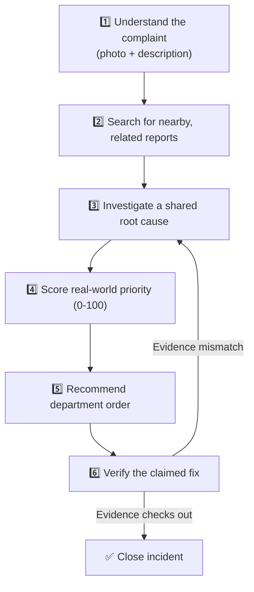

 <div align="center">

# 🏙️ CivicIQ
### Autonomous Civic Incident Intelligence System

**"Different complaints. One hidden signal."**

*Cities don't have a shortage of complaints. They have a shortage of intelligence connecting those complaints.*


</div>

---

## 📑 Table of Contents

<table>
<tr>
<td valign="top" width="33%">

**Understanding CivicIQ**
1. [What Is This Project?](#1-what-is-this-project)
2. [The Problem](#2-the-problem)
3. [The Solution](#3-the-solution)
4. [Why This Is "Agentic AI"](#4-why-this-is-agentic-ai-not-just-a-chatbot)
5. [The Agent Pipeline](#5-how-it-works--the-agent-pipeline)
6. [Meet the Agents](#6-meet-the-agents)

</td>
<td valign="top" width="33%">

**Using CivicIQ**
7. [Key Features](#7-key-features)
8. [Technology Stack](#8-technology-stack)
9. [Project Structure](#9-project-structure)
10. [Getting Started](#10-getting-started)
11. [Environment Variables](#11-environment-variables)
12. [API Reference](#12-api-reference)

</td>
<td valign="top" width="33%">

**Trust & Context**
13. [About the Data](#13-about-the-data-please-read)
14. [Demo Walkthrough](#14-demo-walkthrough)
15. [Human-in-the-Loop](#15-human-in-the-loop-whos-really-in-charge)
16. [Safety & Limitations](#16-safety-honesty-and-limitations)
17. [MVP vs. Next Steps](#17-what-we-built-vs-what-wed-build-next)
18. [Future Scope](#18-future-scope)
19. [Team](#19-team)

</td>
</tr>
</table>

---

## 1. What Is This Project?

**CivicIQ** is a prototype system that helps city governments make sense of citizen complaints — potholes, water leaks, broken streetlights, garbage overflow, and so on.

Instead of treating every complaint as its own isolated ticket, CivicIQ figures out:

| Question | CivicIQ's Job |
|---|---|
| Which complaints are actually connected? | 🔗 Links related reports automatically |
| What's really causing this? | 🕵️ Investigates a probable root cause |
| How urgent is it, really? | 📊 Scores real-world impact, not complaint count |
| Who should act, and in what order? | 🏛️ Sequences the right departments |
| Did the fix actually work? | ✅ Verifies with photo + GPS evidence |

It is built as a **working software prototype** — a real backend, a real dashboard, and a set of cooperating AI agents — not a slideshow concept.

---

## 2. The Problem

Every city receives a constant stream of complaints like these:

> 🕳️ A resident reports a pothole on Elm Street.
> 💧 Someone else reports water leaking near a footpath, 80 metres away.
> 🛣️ A third resident reports the road surface crumbling nearby.
> 🌊 A fourth reports water pooling in the same street after rain.

Most municipal complaint systems treat these as **four unrelated tickets**. Four different departments might each send someone out, fix the surface-level symptom they were told about, and move on — without anyone noticing all four reports are actually **one underlying problem**.


The result: repeated repairs, wasted budget, and problems that keep coming back.

> Cities aren't short on complaints. **They're short on the intelligence needed to connect the dots between them.**

---

## 3. The Solution

CivicIQ acts like a team of specialists reviewing every incoming complaint:



At every step, a human authority reviews and approves the important decisions. **CivicIQ investigates and recommends; people decide.**

---

## 4. Why This Is "Agentic AI" (Not Just a Chatbot)

A chatbot answers a question and stops. CivicIQ runs a continuous loop of specialized, cooperating agents that hand off structured information to the next one — and the whole process **persists and evolves over time**, tracking an incident from first report through investigation, action, and verification (and back again, if the fix didn't hold).

```
OBSERVE → UNDERSTAND → CONNECT → INVESTIGATE → PRIORITIZE
   → PLAN → ACT/RECOMMEND → TRACK → VERIFY → REPLAN OR ESCALATE
```

Two design rules make this trustworthy rather than a "black box":

> 🧮 **Anything that can be calculated with plain logic (distances, dates, scores, statuses) is calculated with plain code — not guessed by an AI model.** The AI is used only where real judgment or language understanding is needed.

> 🔍 **Every AI decision is shown with its reasoning** — what was decided, what evidence supported it, how confident the system is, and what it recommends next. Nothing is presented as fact without a visible trail behind it.

---

## 5. How It Works — The Agent Pipeline

| Step | Stage | What Happens |
|:-:|---|---|
| 1 | 👁️ **Perception** | The photo and description are analyzed to identify the issue type and severity. |
| 2 | 📍 **Clustering** | Checks whether nearby complaints (in distance and time) might be related. |
| 3 | 🔍 **Incident Detection** | Decides if this is standalone, a duplicate, or part of a bigger pattern. |
| 4 | 🕸️ **Root Cause Investigation** | Proposes a possible underlying cause — clearly labeled as a hypothesis. |
| 5 | ⚠️ **Impact Scoring** | Calculates a priority score (0–100) from real-world risk factors. |
| 6 | 🏛️ **Response Planning** | Suggests which department should act, and in what order. |
| 7 | ✋ **Human Approval** | A civic authority reviews and approves the plan. |
| 8 | ⏰ **Tracking & Escalation** | Flags and escalates if nothing happens in the expected window. |
| 9 | 📸 **Resolution Verification** | Checks before/after evidence before confirming a fix. |
| 10 | 🔁 **Reopen or Close** | Formally closes the incident — or reopens it if the fix didn't hold. |

Every step is visible on the dashboard, in real time, as an animated pipeline — so anyone watching can see exactly what the system is doing and why.

---

## 6. Meet the Agents

<details open>
<summary><strong>Click to expand full agent roster</strong></summary>

<br>

| Agent | Job | Uses AI For | Uses Plain Code For |
|---|---|---|---|
| 👁️ **Perception** | Reads photo + description, classifies issue and severity | Describing what's visible in the photo | Looking up known classifications for demo reliability |
| 📍 **Geo-Temporal Clustering** | Finds nearby, recent complaints that might be related | Reasoning about *why* two issues might connect | Calculating actual distance and time gaps |
| 🔍 **Incident Detection** | Decides if a cluster is one incident, duplicates, or unrelated | Explaining the reasoning in plain language | Applying classification rules |
| 🕸️ **Root Cause Investigation** | Proposes a likely underlying cause and event chain | Narrating the hypothesis and its confidence | Looking up known cause-effect relationships |
| ⚠️ **Civic Impact** | Scores how urgent/important the incident really is | Explaining the score in plain language | Calculating the score from weighted factors |
| 🏛️ **Response Orchestration** | Decides which department(s) act, and in what order | Explaining why that sequence avoids wasted work | Looking up department responsibilities |
| 📄 **Complaint Drafting & Filing** | Writes a clear, formal complaint record | Drafting the complaint text | Assigning IDs, timestamps, and status |
| ⏰ **Escalation** | Watches for incidents taking too long | — | Checking deadlines, triggering reminders |
| ✅ **Resolution Verification** | Checks whether a "fix" is backed by real evidence | Comparing and explaining evidence | Comparing GPS coordinates and timestamps |
| 🧭 **Orchestrator** | Runs the whole pipeline, logs every agent's actions | — | Manages overall workflow and incident state |

</details>

---

## 7. Key Features

<table>
<tr><td>📸</td><td><strong>Citizen reporting</strong></td><td>Upload a photo, pick a location, describe the issue, get a tracking ID.</td></tr>
<tr><td>🔗</td><td><strong>Automatic incident linking</strong></td><td>Connects related complaints instead of treating them separately.</td></tr>
<tr><td>🧠</td><td><strong>Explainable root-cause hypotheses</strong></td><td>Always labeled as AI-generated, recommending human inspection.</td></tr>
<tr><td>📊</td><td><strong>Real-world impact scoring</strong></td><td>Urgency based on safety and consequences, not just complaint volume.</td></tr>
<tr><td>🏛️</td><td><strong>Department response planning</strong></td><td>A sensible action order, not everyone showing up at once.</td></tr>
<tr><td>🕒</td><td><strong>Live agent activity timeline</strong></td><td>See the system think, step by step, in real time.</td></tr>
<tr><td>🔍</td><td><strong>Resolution verification</strong></td><td>Before/after evidence checked before a case is allowed to close.</td></tr>
<tr><td>🔁</td><td><strong>Reopen & escalate logic</strong></td><td>Problems that come back are automatically flagged again.</td></tr>
<tr><td>✅</td><td><strong>Human approval gates</strong></td><td>Every high-impact decision waits for a person to say yes.</td></tr>
</table>

---

## 8. Technology Stack

<table>
<tr>
<td valign="top" width="50%">

### 🔧 Backend
- **Python 3.11+**, FastAPI, Pydantic
- JSON files as the prototype's data store (no external database required)
- AI calls via **Anthropic API** and/or **Google Gemini API**

</td>
<td valign="top" width="50%">

### 🎨 Frontend
- **React 18** + Vite + TypeScript
- Tailwind CSS + shadcn/ui components
- Recharts (charts), Lucide (icons)

</td>
</tr>
</table>

---

## 9. Project Structure

```
civiciq/
├── backend/
│   ├── main.py                  # FastAPI app entry point
│   ├── agents/                  # One file per agent (see Section 6)
│   ├── tools/                   # Plain-code helpers: distance math, scoring, lookups
│   ├── services/                # AI model wrappers (text + vision)
│   ├── data/                    # Synthetic complaints, incidents, knowledge bases
│   └── scripts/
│       ├── seed_data.py         # Generates the synthetic demo dataset
│       └── reset_demo.py        # Resets the demo to a clean starting state
├── frontend/
│   └── src/
│       ├── pages/               # CitizenView.tsx, AuthorityDashboard.tsx
│       ├── components/          # AgentPipeline, IncidentCard, ImpactScoreGauge, etc.
│       └── lib/api.ts           # Talks to the backend
├── requirements.txt
├── package.json
├── .env.example
└── README.md
```

---

## 10. Getting Started

### ✅ Prerequisites
- Python 3.11 or newer
- Node.js 18 or newer
- An API key for Anthropic and/or Google Gemini

### 🐍 Backend Setup

```bash
cd backend
python -m venv venv
source venv/bin/activate          # on Windows: venv\Scripts\activate
pip install -r requirements.txt

cp .env.example .env              # then fill in your API key
python scripts/seed_data.py       # generates the synthetic demo dataset
uvicorn main:app --reload         # starts the backend at http://localhost:8000
```

### ⚛️ Frontend Setup

```bash
cd frontend
npm install
npm run dev                       # starts the dashboard at http://localhost:5173
```

### 🔄 Resetting the Demo

Before any live demo or fresh test run:

```bash
python backend/scripts/reset_demo.py
```

This restores all four seeded scenarios to their starting state so the walkthrough behaves identically every time.

---

## 11. Environment Variables

Copy `.env.example` to `.env` and fill in the values below.

| Variable | Description |
|---|---|
| `ANTHROPIC_API_KEY` | API key for Claude models (reasoning/narration steps) |
| `GEMINI_API_KEY` | API key for Google Gemini models (optional alternative) |
| `AI_PROVIDER` | Default provider: `anthropic` or `gemini` |
| `DEMO_MODE` | Set `true` to enable "advance demo time" and reset endpoints |

> ⚠️ **Never commit your `.env` file or any real API key to version control.**

---

## 12. API Reference

<details>
<summary><strong>📡 Click to expand full API endpoint list</strong></summary>

<br>

| Method | Route | Purpose |
|:-:|---|---|
| `POST` | `/reports` | Submit a new citizen report |
| `GET` | `/reports` | List all reports |
| `GET` | `/reports/{report_id}` | Get one report's details |
| `POST` | `/analyze/{report_id}` | Run the Perception Agent on a report |
| `GET` | `/incidents` | List all incidents |
| `GET` | `/incidents/{incident_id}` | Get one incident's full state |
| `POST` | `/incidents/{incident_id}/analyze` | Run clustering + root-cause analysis |
| `GET` | `/incidents/{incident_id}/impact` | Get the Civic Impact Score |
| `GET` | `/incidents/{incident_id}/response-plan` | Get the recommended department action order |
| `POST` | `/incidents/{incident_id}/approve-plan` | Human approval of the response plan |
| `POST` | `/incidents/{incident_id}/resolution` | Submit resolution evidence |
| `POST` | `/incidents/{incident_id}/verify-resolution` | Run the Resolution Verification Agent |
| `POST` | `/incidents/{incident_id}/advance-demo-time` | Fast-forward the demo clock |
| `GET` | `/agent-logs` | View the full agent activity log |
| `GET` | `/dashboard/stats` | Summary numbers for the dashboard |
| `POST` | `/dev/reset-demo` | Reset all seeded scenarios |
| `GET` | `/dev/scenarios` | List the pre-built demo scenarios |

</details>

---

## 13. About the Data (Please Read)

> 🔒 **CivicIQ uses entirely synthetic, made-up civic complaint data for this prototype.** No real citizen reports, real photos of real infrastructure, real department names, or real government officials are used or represented.

The dataset includes 50+ generated reports across several city wards, with four scenarios built in for reliable demonstration:

| # | Scenario |
|:-:|---|
| 1 | Water leakage → road damage → pothole → waterlogging |
| 2 | Drain blockage → waterlogging → garbage accumulation |
| 3 | Low complaint count, high risk: exposed electrical wiring near a school |
| 4 | Repeated pothole reports after a previously claimed "resolved" status |

Any complaint filing shown is a **simulated municipal grievance workflow for demonstration purposes only** — it does not connect to any real government system.

---

## 14. Demo Walkthrough

| Step | Action | System Response |
|:-:|---|---|
| 1 | Citizen submits a water-leakage report | Perception Agent classifies it: High severity, 91% confidence |
| 2 | — | Clustering Agent finds 5 related reports within 180 metres |
| 3 | — | Incident Detection Agent creates `INC-2026-001` |
| 4 | — | Root Cause Agent proposes: *Water Leak → Road Weakening → Road Damage → Pothole → Waterlogging* (84% confidence, labeled as hypothesis) |
| 5 | — | Impact Agent scores it **86/100 — Critical** |
| 6 | — | Response Agent recommends a 5-step, dependency-ordered plan → human approves |
| 7 | Mismatched "after" photo submitted | System responds: *"Resolution could not be verified — location mismatch"* → case stays open |
| 8 | Correct after-photo submitted | System confirms: *"Resolution verified"* → incident closes, risk drops Critical → Low |
| 9 *(optional)* | Click "Advance Demo Time +3 Days" on an unresolved incident | Escalation logic triggers live |

> 🎥 **Presenter tip:** Steps 7–8 are the emotional core — the system *refuses* a wrong photo before accepting the right one. Let that moment breathe.

---

## 15. Human-in-the-Loop: Who's Really in Charge

CivicIQ is a **decision-support tool**, not an autonomous decision-maker. These actions always require explicit human approval:

- ✋ Approving a multi-department response plan
- 📢 Escalating an incident
- 🔒 Closing a critical incident when verification confidence is low
- 🔁 Reopening an incident based only on uncertain AI evidence

The system's job is to investigate, explain, and recommend. **A person makes the final call on anything with real-world consequences.**

---

## 16. Safety, Honesty, and Limitations

- **Root-cause hypotheses are never presented as confirmed diagnoses.** Always labeled *"AI-generated civic incident hypothesis — physical inspection recommended."*
- **The system never accuses anyone of wrongdoing.** Mismatched evidence is described neutrally — *"evidence mismatch"* or *"additional inspection recommended"* — never fraud or negligence.
- **This is a prototype built on synthetic data.** Not tested against real citizen data, real department workflows, or real-world edge cases. Not production-ready.
- **AI-generated text can be wrong.** Confidence scores are estimates, not guarantees — every AI-driven decision is shown with supporting evidence so a human can judge it.

---

## 17. What We Built vs. What We'd Build Next

<table>
<tr>
<td valign="top" width="50%">

### ✅ Fully Working (MVP)
- End-to-end agent pipeline: report → resolution verification
- Deterministic geo-temporal clustering, impact scoring, dependency-ordered response planning
- Reliable seed-image classification path (no unpredictable live model responses) with AI narrative text layered on top
- Live agent activity timeline on the dashboard
- Resolution verification with realistic fail-then-succeed demo flow
- One-command demo reset for repeatable testing

</td>
<td valign="top" width="50%">

### 🔜 Intentionally Deferred
- Full vision-model analysis on freely-uploaded (non-seed) photos
- Complaint drafting in Hindi, in addition to English
- Complete multi-level SLA reminder ladder
- Mobile-responsive polish and animation on citizen-facing pages

</td>
</tr>
</table>

> We're listing these openly rather than hiding the gaps — we'd rather be honest about scope than imply this is more finished than it is.

---

## 18. Future Scope

- 🔌 Integration with a real municipal grievance/ERP system
- 📱 Real-time notifications to citizens as their linked incident progresses
- 🌐 A public transparency view showing city-wide incident trends (with privacy safeguards)
- 📚 Expanding the civic dependency knowledge base with real engineering input
- 🗣️ Support for more languages beyond English and Hindi
- 🔄 A feedback loop where verified outcomes improve future root-cause hypotheses

---

## 19. Team

| Member | Role |
|---|---|
| **Mayank Sharma** | Project Lead • Multi-Agent Architecture • Backend Integration |
| **Prakhar** | Frontend Development • UI/UX • Dashboard |
| **Om Rawat** | Backend Development • API Integration • Agent Workflow |
| **Kapil** | AI Engineering • Vision AI • Knowledge Base • Testing |

---

<div align="center">

*CivicIQ is a prototype built for demonstration purposes. All data is synthetic.*
*Not affiliated with, endorsed by, or connected to any real municipal government or grievance system.*

</div>
